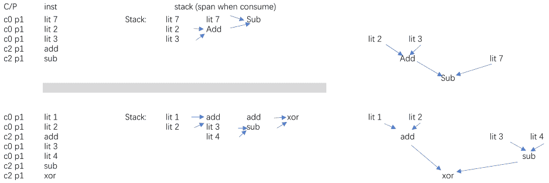

Use a stack to store instructions.

  When an instruction requires (some) elements to consume, move those
instructions as children (begin of children = last stack element used by inst.).

  Connect all nodes together.
